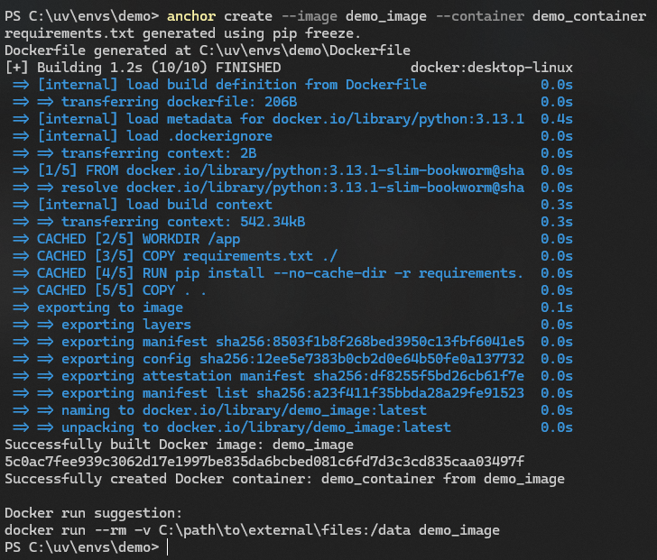

# ⚓ Anchor

Anchor is a small command-line tool that helps simplify the setup of a Python project for Docker. It scans your code for external file paths, generates a requirements.txt from your virtual environment, creates a Dockerfile, and then builds the Docker image. Finally, it provides a suggested docker run command with a suitable volume mount. It doesn’t run containers itself—only builds them to get you closer to a working Dockerized environment.

## Usage

## Flags

The `create` command supports the following flags to customize Docker image and container creation:

| Flag                | Description                                               | Required | Default                       |
|---------------------|-----------------------------------------------------------|----------|-------------------------------|
| `--image`           | **Docker Image Name.** Specifies the name for the image.  | Yes      | N/A                           |
| `--container`       | **Docker Container Name.** Sets a custom container name.  | No       | Automatically assigned        |
| `--ports`           | **Port Mappings.** Maps host ports to container ports.          | No       | No ports mapped               |
| `--python`          | **Python Version.** Chooses the Python version (e.g., 3.13). | No    | `3.13`                        |
| `--debug`           | **Enable Debug Logging.** Activates detailed logs.        | No       | `False`                       |
